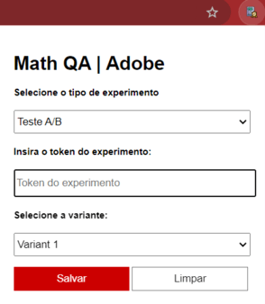

# Santander QA | Adobe Extension

Esta extensão do Chrome foi criada para facilitar o gerenciamento de experimentos no Adobe Target para o ambiente de QA do Santander. Através da interface, é possível selecionar o tipo de experimento, inserir o token do experimento e, no caso de testes A/B, escolher uma variante específica. A extensão permite salvar essas informações no cookie e também limpar os cookies relacionados ao experimento.

## Funcionalidades

- **Seleção do tipo de experimento**: O usuário pode escolher entre "Teste A/B" ou "Personalização".
- **Inserção do token do experimento**: Um campo de texto onde o token do experimento pode ser inserido.
- **Seleção da variante (apenas para Teste A/B)**: Caso o experimento seja um Teste A/B, a extensão habilita a escolha entre as variantes: `controler`, `variant1`, `variant2`, `variant3` e `variant4`.
- **Botão de Salvar**: Salva as informações do experimento no cookie do navegador.
- **Botão de Limpar**: Limpa os cookies relacionados ao experimento.

## Instalação

### Método 1: Carregar no modo desenvolvedor

1. Faça o download ou clone este repositório em sua máquina local.
2. No Chrome, navegue até `chrome://extensions/`.
3. Ative o **Modo de Desenvolvedor** no canto superior direito.
4. Clique em **Load unpacked** e selecione a pasta que contém os arquivos da extensão.

### Método 2: Instalar via arquivo .crx (não recomendado para produção)

1. Empacote os arquivos da extensão em um `.crx` usando o Chrome:
   - Acesse `chrome://extensions/`.
   - Habilite o modo de desenvolvedor e clique em **Empacotar extensão**.
   - Escolha a pasta da extensão e siga as instruções.
2. Instale a extensão arrastando o arquivo `.crx` para a janela do Chrome.

> **Nota**: Este método pode ser bloqueado no Windows e macOS devido a políticas de segurança do Chrome. O recomendado é utilizar a Chrome Web Store para distribuição.

## Uso

1. Clique no ícone da extensão na barra de ferramentas do Chrome.
2. Na janela pop-up, escolha o tipo de experimento:
   - **Teste A/B**: Escolha a variante desejada.
   - **Personalização**: Nenhuma variante será exibida.
3. Insira o token do experimento no campo correspondente.
4. Clique em **Salvar** para armazenar os dados no cookie.
5. Para limpar os cookies do experimento, clique em **Limpar**.

## Permissões

A extensão requer as seguintes permissões:

- **cookies**: Para ler e gravar cookies nos sites especificados.
- **storage**: Para armazenar as preferências do usuário, como o tipo de experimento e o token.
- **host_permissions**: Para acessar cookies no domínio do site que você está testando (no caso, o domínio do Santander).

## Estrutura de Arquivos

- `manifest.json`: Configurações da extensão.
- `popup.html`: Interface gráfica da extensão.
- `popup.js`: Lógica de interação da interface com o armazenamento de cookies.

## Notas

- Certifique-se de que o domínio correto do site onde o cookie será utilizado está configurado no arquivo `manifest.json` no campo `host_permissions`.
- O tempo de expiração do cookie pode ser ajustado diretamente no código.

## Contribuições

Sinta-se à vontade para abrir issues ou enviar pull requests para melhorias. Esta é uma ferramenta interna que pode evoluir conforme as necessidades do time de QA do Santander.

## Licença

Este projeto está sob a licença MIT.